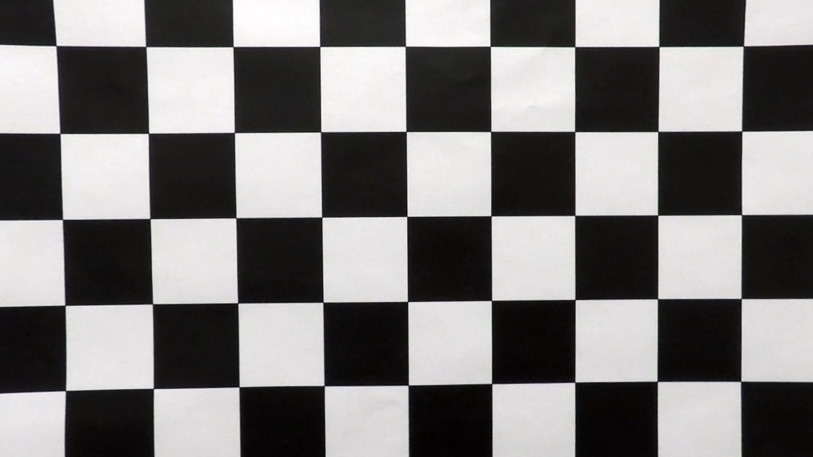

## Writeup

---

**Advanced Lane Finding Project**

The goals / steps of this project are the following:

* Compute the camera calibration matrix and distortion coefficients given a set of chessboard images.
* Apply a distortion correction to raw images.
* Use color transforms, gradients, etc., to create a thresholded binary image.
* Apply a perspective transform to rectify binary image ("birds-eye view").
* Detect lane pixels and fit to find the lane boundary.
* Determine the curvature of the lane and vehicle position with respect to center.
* Warp the detected lane boundaries back onto the original image.
* Output visual display of the lane boundaries and numerical estimation of lane curvature and vehicle position.

[//]: # (Image References)

[undistorted_test1]: ./output_images/test1_undistorted.jpg "Road Transformed"
[threshold_image]: ./output_images/test1_thresholds.jpg "Thresholding Example"
[straight_lines1_warped]: ./output_images/straight_lines1_warped.jpg "Warp Example"
[warped_annotated_curve]: ./output_images/curve_warped_annotated.jpg "Annotated warped curve"
[curve_result]: ./output_images/curve_result.jpg "Curve result output example"

## [Rubric](https://review.udacity.com/#!/rubrics/571/view) Points

### Here I will consider the rubric points individually and describe how I addressed each point in my implementation.  

---

### Writeup / README

#### 1. Provide a Writeup / README that includes all the rubric points and how you addressed each one.

You're reading it!

### Implementation source code
The complete implementation is in the file [lanelines.py](lanelines.py). Any functions or line numbers referred to below are in that file unless stated otherwise.

### Camera Calibration

#### 1. Briefly state how you computed the camera matrix and distortion coefficients. Provide an example of a distortion corrected calibration image.

The main code for this step is contained in the [calibration_params()](lanelines.py#L69) function of the file `lanelines.py`). It calls [accumulate_calibration()](lanelines.py#L39) for each input calibration image.

I start by preparing "object points", which will be the (x, y, z) coordinates of the chessboard corners in the world. Here I am assuming the chessboard is fixed on the (x, y) plane at z=0, such that the object points are the same for each calibration image.  Thus, `objp` is just a replicated array of coordinates, and `objpoints` will be appended with a copy of it every time I successfully detect all chessboard corners in a test image.  `imgpoints` will be appended with the (x, y) pixel position of each of the corners in the image plane with each successful chessboard detection.

Then in [image_calibration_params()](lanelines.py#L64) I used the output `objpoints` and `imgpoints` to compute the camera calibration and distortion coefficients using the `cv2.calibrateCamera()` function.  I applied this distortion correction to the test image using the `cv2.undistort()` function in [undistort_image()](lanelines.py#L85)and obtained this result on one of the calibration images:

Distorted original:


Undistorded:



### Pipeline (single images)

#### 1. Provide an example of a distortion-corrected image.

For each video frame the process is similar, to correcting a calibration image, just use the same parameters and the function [undistort_image()](lanelines.py#L85) on an image, below as an example the `test_images/test1.jpg` corrected:

![test1 undistorted][undistorted_test1]

#### 2. Describe how (and identify where in your code) you used color transforms, gradients or other methods to create a thresholded binary image.  Provide an example of a binary image result.

I used a combination of color and gradient thresholds to generate a binary image. Color thresholding was done on on the S channel of the HLS color space. Gradient thresholding was done on the L channel, using the Sobel operator to detect vertical lines. You can find the algorith in the function [threshold_pipeline()](lanelines.py#L91). The red areas are by color thresholding, the green is by gradient thresholding. As you can see in the example output they complement each other for detection of lane lines.

Here's an example of my output for this step, using the previous undistorted image as input:

![color and gradient thresholding][threshold_image]

#### 3. Describe how (and identify where in your code) you performed a perspective transform and provide an example of a transformed image.

The code for my perspective transform includes the function [dashboard_to_overhead()](lanelines.py#L121).  The `dashboard_to_overhead()` function takes as inputs an image (`img`), as well as source (`src`) and destination (`dst`) points.  I chose the hardcode the source and destination points in the following manner:

```python
    src = np.float32([[610, 441], [669, 441], [258, 682], [1049, 682]])
    dst = np.float32([[450, 0], [width - 450, 0], [450, height], [width-450, height]])
```

This resulted in the following source and destination points:

| Source        | Destination   | 
|:-------------:|:-------------:| 
| 610, 441      | 450, 0        |
| 669, 441      | 830, 0        |
| 258, 682      | 450, 720      |
| 1049, 682     | 830, 720      |

I verified that my perspective transform was working as expected by comparing the `src` and `dst` points onto the `straight_lines1.jpg` test image and its warped counterpart and verifying that they are on the same spot on the road and appear parallel in the warped image.

![warped image][straight_lines1_warped]


#### 4. Describe how (and identify where in your code) you identified lane-line pixels and fit their positions with a polynomial?

The lane-line pixels are identified in [find_lane_lines()](lanelines.py#L130). To get a rough estimate of where the left and right lane lines are located, first for the bottom two quadrants of the image, the x-locations with the max intensities are located. Then by stepping through "windows" (vertical slices of the image) where enough potential lane-line pixels are found, the mean location of those lane line pixels are used as the lane line position if there was a match. This is repeated for all the windows, searching only in the neighbourhood of the previous window identified to improve performance and accuracy.

At the end of the [find_lane_lines()](lanelines.py#L205) function, second-order polynomials are determined for the left and right lane lines.

Below is an example of a curve (test_images_test5.jpg) where the windows are visible and polynomials are plotted.

![warped annotated curve][warped_annotated_curve]

#### 5. Describe how (and identify where in your code) you calculated the radius of curvature of the lane and the position of the vehicle with respect to center.

The radius of curvature was calculated in the function [radius_of_curvature()](lanelines.py#L249) based on the polynomials identified earlier. The radii is calculated as
```python
left_curverad = ((1 + (2*left_fit_cr[0]*y_eval*ym_per_pix + left_fit_cr[1])**2)**1.5) / np.absolute(2*left_fit_cr[0])
right_curverad = ((1 + (2*right_fit_cr[0]*y_eval*ym_per_pix + right_fit_cr[1])**2)**1.5) / np.absolute(2*right_fit_cr[0])
```
The pixel-measurements are scaled with an y factor of 30/720 and an x factor of 3.7/700, which gave me radii of 388 m and 562 m, when the correct radius should have been around 1000m. Close enough I think ;-)

The offset from the center of the lane was calculated in the function [sideways_offset_lane_center()](lanelines.py#L249) by averaging the x-coordinates of the left and right lane lines at the bottom of the image, calculating that point's offset from the center and multiplying it by the x-meter-per-pixel scaling factor.

#### 6. Provide an example image of your result plotted back down onto the road such that the lane area is identified clearly.

I implemented this step in the function [process_image()](lanelines.py#L316). Here is an example of my result on a test image:

![Final result example][curve_result]

---

### Pipeline (video)

#### 1. Provide a link to your final video output.  Your pipeline should perform reasonably well on the entire project video (wobbly lines are ok but no catastrophic failures that would cause the car to drive off the road!).

Here's a [link to my video result](./output_images/project_video_out.mp4)

---

### Discussion

#### 1. Briefly discuss any problems / issues you faced in your implementation of this project.  Where will your pipeline likely fail?  What could you do to make it more robust?

Here I'll talk about the approach I took, what techniques I used, what worked and why, where the pipeline might fail and how I might improve it if I were going to pursue this project further.  
